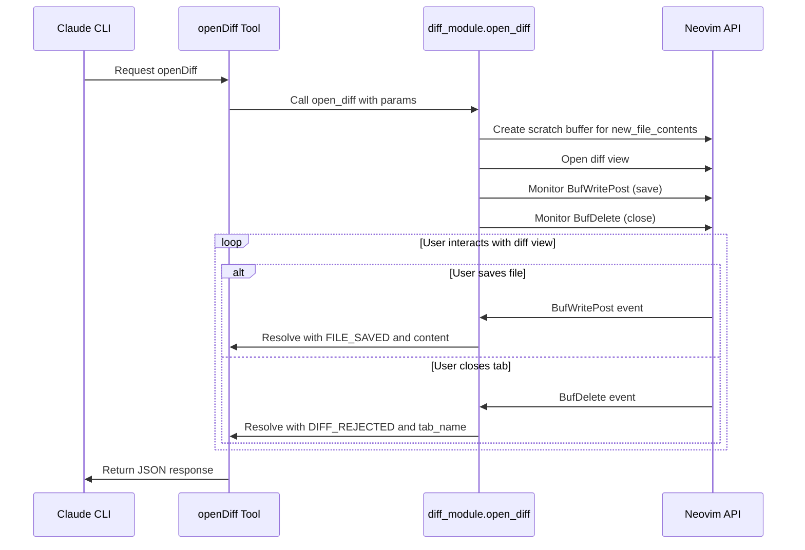

# Plan to Make the openDiff Tool MCP Compliant

This document outlines the plan to make the `openDiff` tool in the Neovim Claude Code integration compliant with the specification defined in `findings.md`. This plan incorporates ideas from a coworker's plan and adds some improvements.

## Discrepancies Between Specification and Implementation

1.  **Blocking Behavior**: The current implementation does not block and wait for user interaction.
2.  **Return Values**: The current implementation returns a simple success message instead of specific JSON responses based on user action.
3.  **Error Handling**: The current implementation lacks specific error handling for user actions like rejecting the diff or failing to save the file.

## Revised Plan

**Phase 1: Core Architecture Changes**

- **Enhance `diff.lua` Module**:
  - Add `open_diff_blocking()` function that returns a "promise-like" table.
  - Implement event monitoring system using Neovim autocmds.
  - Track diff state per `tab_name` to handle multiple concurrent diffs.
  - Add cleanup mechanisms for temporary files and event listeners.
- **User Action Tracking**:
  - Use the following autocmds:
    - `BufWritePost`: File saved (`FILE_SAVED`)
    - `TabClosed`/`BufDelete`: Tab closed (`DIFF_REJECTED`)
- **State Management**:

  - Adopt the `active_diffs` table structure:

  ```lua
  local active_diffs = {
    [tab_name] = {
      old_file_path = "...",
      new_file_path = "...",
      new_file_contents = "...",
      temp_files = {...},
      autocmd_ids = {...},
      status = "pending", -- "pending", "saved", "rejected"
      result_content = nil
    }
  }
  ```

**Phase 2: Blocking Implementation**

- **Coroutine-Based Waiting**:

  - Use coroutines to implement blocking behavior.
  - The `handler` function should become:

  ```lua
  local function handler(params)
    -- Set up diff and monitoring
    local co = coroutine.running()
    local diff_id = setup_blocking_diff(params, function(result)
      coroutine.resume(co, result)
    end)

    -- Wait for user action
    return coroutine.yield()
  end
  ```

- **MCP Content Format**:
  - Ensure return format compliance:
    - Success: `{content = {{type="text", text="FILE_SAVED"}, {type="text", text=file_contents}}}`
    - Reject: `{content = {{type="text", text="DIFF_REJECTED"}, {type="text", text=tab_name}}}`

**Phase 3: Event Integration**

- **Autocmd Setup**:
  - Monitor `BufWritePost` for save events on diff files.
  - Monitor `TabClosed` and `BufDelete` for rejection events.
  - Set up keymaps for explicit accept/reject actions (optional for initial implementation).
  - Clean up autocmds when the diff resolves.
- **Temporary File Management**:
  - Create temp files for `new_file_contents` in a secure location (using `vim.api.nvim_create_buf(false, true)` to create a scratch buffer).
  - Ensure proper cleanup regardless of user action.
  - Handle concurrent diffs with unique temp file names.

**Phase 4: Testing & Validation**

- **Behavior Validation**:
  - Test blocking behavior with multiple scenarios.
  - Verify correct MCP content format is returned.
  - Test cleanup of resources (autocmds, temp files).
  - Test concurrent diff handling.
- **Edge Case Handling**:
  - Handle Neovim shutdown during a pending diff.
  - Handle invalid file paths gracefully.
  - Handle permission errors on temp file creation.

## Mermaid Diagram



## Changes and Additions to the Coworker's Plan:

- **Temporary File Creation**: Instead of creating actual temporary files on disk, use Neovim's scratch buffers (`vim.api.nvim_create_buf(false, true)`). This is more efficient and avoids potential permission issues.
- **Keymaps**: Make the keymap implementation optional for the initial implementation. It can be added later as an enhancement.
- **Error Handling**: Add more specific error handling for cases where the `diff_module.open_diff` function fails to open the diff view.
