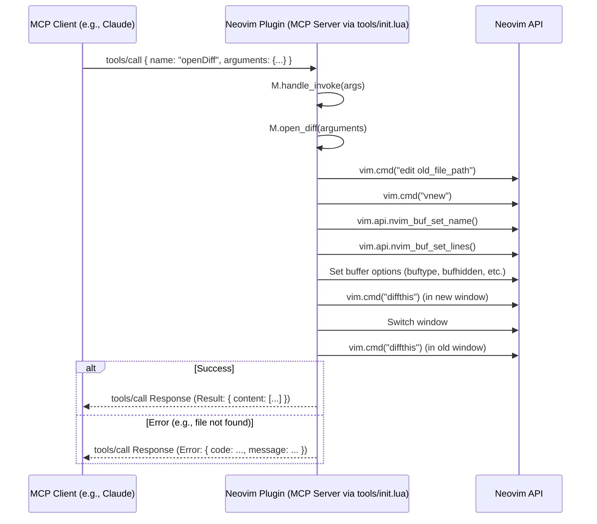

# Final Plan for Implementing the `openDiff` MCP Tool

## 1. Introduction

The goal is to implement the `openDiff` tool as specified by the Model Context Protocol (MCP). This tool will allow an MCP client (like Claude) to request Neovim to display a diff view between an existing file (`old_file_path`) and new content (`new_file_contents`). The implementation will use Neovim's native diffing capabilities.

## 2. `openDiff` Tool Definition and MCP Registration

- **Name**: `openDiff`
- **Description**: "Open a diff view between an existing file and new content."
- **Parameters** (all REQUIRED as per `findings.md`):
  - `old_file_path` (string): Path to the original file.
  - `new_file_path` (string): Path to associate with the new content (e.g., for buffer context, or if `tab_name` is not sufficiently descriptive).
  - `new_file_contents` (string): The full content of the "new" version of the file.
  - `tab_name` (string): Suggested name for the diff tab/buffer displaying the new content.
- The `inputSchema` in the `tools/list` MCP response will be updated to reflect these parameters and their descriptions.
- The implementation will be by modifying the existing `M.open_diff` function within `lua/claudecode/tools/init.lua`. This function is already registered in `M.register_all()`.

## 3. MCP Interaction Flow for `openDiff`

The MCP request/response flow will follow the standard pattern:

1. Client sends `tools/call` with `name: "openDiff"` and the specified arguments.
2. The `M.handle_invoke` function in `lua/claudecode/tools/init.lua` receives the call.
3. `M.handle_invoke` calls `M.tools["openDiff"](params.input)`, which is our `M.open_diff` function.
4. `M.open_diff` executes, performs Neovim actions.
5. If successful, `M.open_diff` returns a table representing the `content` array for the MCP response (e.g., `{{ type = "text", text = "Diff view opened..." }}`).
6. If an error occurs within `M.open_diff` (e.g., file not found), it should call `error("message")`.
7. `M.handle_invoke`'s `pcall` will catch this error and construct the standard JSON-RPC error response.
8. The response (success or error) is sent back to the client.

**Mermaid Diagram:**



## 4. Neovim Implementation Details

The `M.open_diff` function in `lua/claudecode/tools/init.lua` will be implemented as follows:

```lua
-- In lua/claudecode/tools/init.lua

-- Tool: Open a diff view
-- params = { old_file_path, new_file_path, new_file_contents, tab_name }
function M.open_diff(params)
  -- 1. Validate parameters
  if not params.old_file_path or not params.new_file_path or not params.new_file_contents or not params.tab_name then
    error("Missing required parameters for openDiff. Required: old_file_path, new_file_path, new_file_contents, tab_name.")
  end

  local old_file_path = params.old_file_path
  -- new_file_path can be used for additional context if tab_name is generic,
  -- or potentially to inform filetype detection if the scratch buffer needs it,
  -- though tab_name is the primary identifier for the new content's buffer.
  local new_file_contents = params.new_file_contents
  local tab_name = params.tab_name

  -- Validate old_file_path readability
  if vim.fn.filereadable(old_file_path) == 0 then
    error("Failed to open diff: Original file '" .. old_file_path .. "' not found or not readable.")
  end

  -- 2. Open old file in the current window
  vim.cmd("edit " .. vim.fn.fnameescape(old_file_path))
  local old_win = vim.api.nvim_get_current_win()

  -- 3. Create a new vertical split for the new content
  vim.cmd("vnew")
  local new_win = vim.api.nvim_get_current_win()
  local new_buf = vim.api.nvim_get_current_buf()

  -- Set buffer name for the new content
  vim.api.nvim_buf_set_name(new_buf, tab_name)

  -- Populate the new buffer with new_file_contents
  local lines = vim.split(new_file_contents, '\\n', { plain = true, trimempty = false })
  vim.api.nvim_buf_set_lines(new_buf, 0, -1, false, lines)

  -- Set buffer options for the scratch buffer
  vim.bo[new_buf].buftype = 'nofile'
  vim.bo[new_buf].bufhidden = 'hide'
  vim.bo[new_buf].swapfile = false
  vim.bo[new_buf].modifiable = true

  -- 4. Activate diff mode for both windows
  vim.api.nvim_set_current_win(new_win)
  vim.cmd("diffthis")

  vim.api.nvim_set_current_win(old_win)
  vim.cmd("diffthis")

  -- Ensure scrollbind is active
  vim.wo[new_win].scrollbind = true
  vim.wo[old_win].scrollbind = true

  -- Focus the new content window
  vim.api.nvim_set_current_win(new_win)

  return {
    { type = "text", text = "Diff view '" .. tab_name .. "' opened successfully." }
  }
end
```

## 5. Testing Strategy

- **Unit Tests (Lua)**:
  - Target `M.open_diff` in `lua/claudecode/tools/init.lua`.
  - Test various inputs: valid paths, invalid `old_file_path`, different `new_file_contents` (empty, multi-line, special characters), missing parameters.
  - Mock Neovim API calls (`vim.cmd`, `vim.api.*`, `vim.bo.*`, `vim.wo.*`, `vim.fn.*`) to verify correct sequences, parameters, and option settings.
  - Verify that `error()` is called appropriately for validation failures.
  - Verify the structure of the success return value.
- **Integration Tests**:
  - Use a test MCP client (e.g., `scripts/mcp_test.sh`) to send `openDiff` `tools/call` requests.
  - Visually inspect Neovim to confirm:
    - Correct window layout (e.g., vertical split).
    - `old_file_path` loaded in one window.
    - `new_file_contents` loaded in the other (scratch buffer).
    - The scratch buffer has the name specified by `tab_name`.
    - Diff highlighting is active.
    - Windows are scroll-bound.
  - Test error conditions (e.g., non-existent `old_file_path`) and verify the MCP error response.

## 6. Conclusion

This plan details the implementation of the `openDiff` MCP tool using Neovim's native diffing capabilities, integrated directly into the existing tool handling structure in `lua/claudecode/tools/init.lua`. This approach is robust and directly addresses the requirements of the `openDiff` tool.
